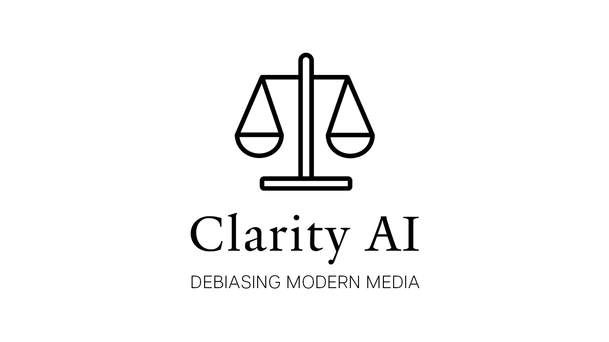

# Clarity AI

A multi-agent LLM approach that brings clarity to complex political topics by debating them from 10 different political perspectives.

## Inspiration

It's election season! At the same time, politics has become full of noise and partisanship, a shift exacerbated by social media and the click-driven nature of modern journalism. It almost seems like different pockets of the US have entirely different world views—when this is compounded with the lack of desire to engage with "the other side," this self-reinforcing negative cycle divides people and society.

## What it does

Our project provides a way for users to discover politics in a truly unbiased way. The web interface enables the user to enter queries about different political topics. The top search result is scraped and passed to agents from different political backgrounds. The output from all these agents is aggregated to provide a baseline of truth between varying perspectives. Through Google authentication, users can sign up and save their chat histories to a library, enabling them to access past conversations. We also ran our models and webscraper remotely using Modal, speeding up the chatbot responses.

## How we built it

When a user submits a query to our web interface, we first send their prompt through a web scraper run that uses the Google custom search API to find the top articles related to the user's request and extracts the information using BeautifulSoup. This text is then sent to the LLM backend, which we built and hosted with Modal. We deployed a modified version (expanded context, lower batch size) of their TensorRT-Llama implementation on 1x A100 (80GB), reaching ~80 tokens/second on inference and analyzing one article every ~10s. We created custom prompts for each political standpoint, giving specific values and moral frameworks to guide their judgment. The output from the LLM backend is passed to the server backend, which was built with Node.js. The information is then sent to our React frontend and displayed for our user. Other features include authentication with Google Accounts and storage of previous user queries using MongoDB.

## Challenges we ran into

Managing and integrating the data flow—from raw HTML to LLM input / output limitations to web deployment across different API calls and frontend displays was an interesting challenge to solve.

## Accomplishments that we're proud of

We’re extremely proud of our data management workflow, which allows us to easily go from raw HTML to LLM input and finally to our web interface. The problem we're addressing is especially salient, as a vast majority of news sources today are written by people that have a specific political background, and we think we tackle this real-world problem well. The customizability and compact integration of our product into a single platform gives users a way to sift between multiple sources easily, which is key for the unbiased education of not only users but also uninformed voters. Lastly, the design of our product allows it to be easily scaled up if it were pushed to production. The portfolio feature of our tool gives users the ability to save articles that they previously researched and build a continuous habit of thinking and analyzing differing political viewpoints. Additionally, we integrated our workflow with Google authentication, which allows for an easy way to login and store their information in our backend database.
